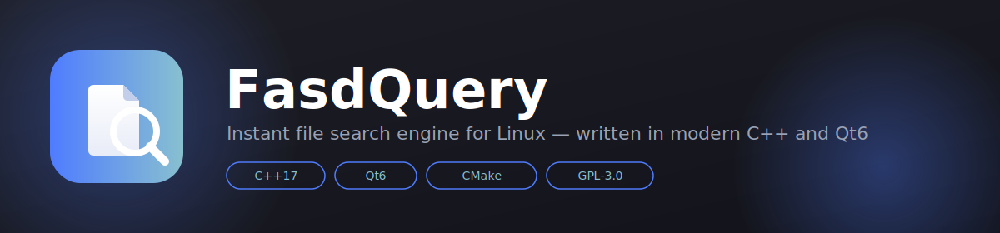
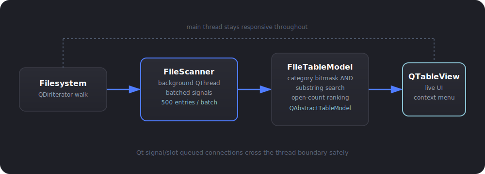
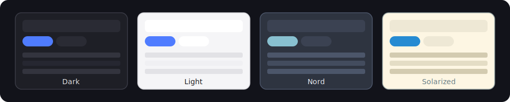

<div align="center">



</div>

# FasdQuery

**FasdQuery** is a lightweight, instant file search engine for Linux, inspired by voidtools' *Everything*. It scans your filesystem in a background thread, filters results live as you type, and lets you act on files immediately — open, reveal, copy path, or trash — without ever leaving the keyboard.

Built entirely with **Qt6 Widgets** and modern **C++17**. No Electron, no runtime bloat, no telemetry.

---

## Features

<table>
<tr>
<td width="90"></td>
<td>

### Instant category filtering
Toggle results by type with a single click — Audio, Video, Images, Documents, Archives, Code. Every file is classified at scan time by extension into a **bitmask category**. Filtering never does string comparison — it's a single `AND` against the active mask, so narrowing hundreds of thousands of results stays instant regardless of dataset size.

</td>
</tr>
<tr>
<td></td>
<td>

### Background filesystem scanning
A dedicated `QThread` walks the filesystem recursively via `QDirIterator`, streaming results back to the UI in batches of 500 entries. The interface never freezes — you can search, filter, and scroll while indexing is still running underneath.

</td>
</tr>
<tr>
<td></td>
<td>

### Live search-as-you-type
Type a few characters and the table narrows immediately — substring match against filenames, no need to press Enter or know the exact name.

</td>
</tr>
<tr>
<td></td>
<td>

### One-click file actions
Right-click any result for a native context menu: **Open file** (via `QDesktopServices`, respects your system's default application), **Show in file manager** (reveals and highlights the exact file using the `org.freedesktop.FileManager1` D-Bus interface, with a safe fallback), **Copy path** to clipboard, or **Move to trash**.

</td>
</tr>
<tr>
<td></td>
<td>

### Popularity-based ranking
FasdQuery remembers which files you open most often from search results and quietly promotes them to the top of future queries — the file you actually want surfaces faster over time.

</td>
</tr>
<tr>
<td></td>
<td>

### Fully themeable interface
Switch instantly between four built-in themes — Dark, Light, Nord, and Solarized — applied live via Qt stylesheets, no restart required.

</td>
</tr>
</table>

---

## Architecture

FasdQuery keeps a strict separation between the scanning engine, the data model, and the UI — connected entirely through queued Qt signals and slots, so the interface thread is never blocked by disk I/O.



| Component | Responsibility |
|---|---|
| `FileScanner` | Recursive filesystem walker running on its own `QThread`; emits results in batches |
| `CategoryFilter` | Maps file extensions to bitmask categories (`0x01` Audio, `0x02` Video, `0x04` Images, `0x08` Documents, `0x10` Archives, `0x20` Code) |
| `FileTableModel` | `QAbstractTableModel` implementation holding all entries, applying search text and category mask filtering, and tracking open-count for ranking |
| `MainWindow` | Builds the UI, wires signals, and handles all context-menu file actions |

---

## Themes



Pick a theme from the dropdown in the top bar — it applies instantly across the entire application via `qApp->setStyleSheet()`.

---

## Building from source

### Requirements

- CMake ≥ 3.16
- A C++17 compiler (GCC or Clang)
- Qt6 development packages: `Widgets`, `Concurrent`, `Svg`

On Debian/Ubuntu-based systems:

```bash
sudo apt install build-essential cmake qt6-base-dev qt6-svg-dev libqt6svg6-dev
```

### Build

```bash
mkdir build && cd build
cmake .. -DCMAKE_BUILD_TYPE=Release
make -j$(nproc)
./FasdQuery
```

---

## Project layout

FasdQuery uses a flat file structure — every source file lives at the project root, no nested `src/` or `include/` directories.

```
fasdquery/
├── CMakeLists.txt
├── main.cpp
├── MainWindow.h / .cpp
├── FileScanner.h / .cpp
├── FileTableModel.h / .cpp
├── CategoryFilter.h / .cpp
├── FileEntry.h
├── icons.qrc
├── app_icon.svg
└── readme_assets/
```

---

## Roadmap

The following features are planned but not yet implemented:

- **Content indexing** — search inside file contents (`content:` prefix), backed by an on-disk inverted index (SQLite)
- **Remote HTTP server** — query and download files from another machine over the local network, mirroring Everything's built-in HTTP server
- **Full OS MIME integration** — deeper context-menu actions per file type (print, extract, etc.)

---

## License

GPL-3.0 — free and open source.
